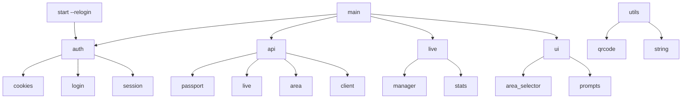

# bili-tools

B站直播开播工具，命令行一键开播/下播。

## 安装

### Cargo (通用)

```bash
# 首次需安装 Rust 工具链
curl --proto '=https' --tlsv1.2 -sSf https://sh.rustup.rs | sh

# 克隆并编译安装
git clone https://github.com/QwerProg/bili-tools.git --depth=1
cd bili-tools
cargo install --path .
```

编译安装到 `~/.cargo/bin/bt`，确认该目录在 PATH 中即可。

### macOS (Homebrew)

```bash
brew tap QwerProg/bili-tools
brew install bt
```

> Homebrew 会从源码编译，首次需要 Rust 工具链，`brew` 会自动安装。

### Linux (AUR)

```bash
yay -S bili-tools       # 稳定版
yay -S bili-tools-git   # 最新 git 版
```

### Windows

#### Winget
```bash
winget install QwerProg.bt
```

#### Scoop

```powershell
# 安装 Scoop
Set-ExecutionPolicy -ExecutionPolicy RemoteSigned -Scope CurrentUser
Invoke-RestMethod -Uri https://get.scoop.sh | Invoke-Expression

# 添加 bucket
scoop bucket add QwerProg https://github.com/QwerProg/bili-tools

# 安装
scoop install bt

# 日后升级
scoop update bt
```

#### 手动下载
从 [Releases](https://github.com/QwerProg/bili-tools/releases) 下载 `bt-x86_64-windows.zip`，解压后即可运行。

## 使用

```bash
bt start                      # 开播（默认，交互式）
bt start -y                   # 自动同意所有确认
bt start -r                   # 清除登录并重新登录后开播
bt start -a 398 -t "标题" -s   # 快捷参数
bt stop                       # 下播
bt stop -d 30m                # 30分钟后下播（阻塞进程，Ctrl+C 取消）
bt status                     # 查看直播状态
bt completions zsh --install  # 安装 Tab 补全
```

### 开播参数

| 参数 | 说明 |
|---|---|
| `-a, --area <ID>` | 指定分区 ID，跳过交互式选择 |
| `-t, --title <标题>` | 指定直播标题，跳过输入 |
| `-s, --show` | 显示完整推流码（默认打码） |
| `-r, --relogin` | 清除登录并重新登录后开播 |

```bash
# 非交互式一键开播
bt start --area 398 --title "晚上随便播会儿" --show
```

### 完整参数

```
Usage: bt <COMMAND> [OPTION]

Commands:
  start    开始直播 (默认支持交互式选择)
  stop     停止直播
  status   查看当前直播状态
  completions  生成 shell 补全脚本
  help     显示帮助信息
  version  显示版本号

提示：查看子命令参数请使用 `bt <command> -h`。例如 `bt start -h`。
```

## 交互流程

```
# 首次使用 — 扫码登录
✔ 选择一种登录方式 · 扫码登录
· 开始B站二维码登录流程...
[终端弹出二维码]
✅ 二维码已保存到 qrcode.png
· 等待用户处理...

# 登录后 — 正常开播
bt start
✅ 登录状态正常
✔ 是否使用上次直播的分区？ · yes
✅ 使用上次的分区: 自习室 - 372
✔ 请输入新标题（回车保留原标题） · 晚上随便播会儿

🎬 直播已开启
  推流地址  rtmp://live-push.bilivideo.com/live-bvc/
  推流码    ?strea************...g=13
  ·  推流信息已写入 ~/.config/bt/stream_info.txt

# 已在播时运行 — 询问下播
bt start
· 检测到当前正在直播中
✔ 检测到当前正在直播中，是否关闭？ · yes
· 准备关闭直播...
🎬 直播已关闭
  统计
  新增粉丝  3
  弹幕数量  42
  直播时长  7200
  最大在线  18
  累计观看  156
  粉丝勋章  2
  金仓鼠    0

# 查看状态 — 显示 B 站电视机 Logo
bt status
```

## 分区选择

使用上下箭头选择分区大类，Enter 确认后选择子分区。

## 技术栈

| 类别 | 依赖 |
|---|---|
| CLI 解析 | `clap 4`（derive 宏） |
| HTTP 请求 | `minreq`（轻量级，rustls TLS） |
| 序列化 | `serde` + `serde_json` |
| 终端 UI | `dialoguer` |
| 二维码 | `qrcode` + `image` |
| 日志 | `log` + `env_logger` |
| 时间 | `chrono` |
| 错误处理 | `thiserror` |
| Rust 版本 | Edition 2024 |

## 架构



```
src/
├── main.rs            # 入口与命令分发
├── api/
│   ├── client.rs      # 公共 User-Agent 常量
│   ├── passport.rs    # 二维码生成/轮询、room_id 查询
│   ├── live.rs        # 直播状态查询、分区查询、标题更新
│   └── area.rs        # 拉取全量分区列表
├── auth/
│   ├── login.rs       # 登录流程（含账号密码/短信/扫码/浏览器）
│   ├── cookies.rs     # cookies.json 读写管理
│   └── session.rs     # 登录状态验证
├── live/
│   ├── manager.rs     # 开播/下播（调用 B站 API，写 stream_info.txt）
│   └── stats.rs       # 下播后拉取直播统计数据
├── ui/
│   ├── area_selector.rs  # dialoguer 两级分区选择器
│   └── prompts.rs        # 输出宏
└── utils/
    ├── qrcode.rs      # 终端 ASCII 二维码 + PNG 保存
    └── string.rs      # 推流码打码
```

### 模块说明

**`main.rs`** — 解析 `clap` 子命令并分发：`start` / `stop` / `status` / `help` / `version`。`start` 支持 `--relogin` 与 `-y` 自动确认；`stop` 支持 `--delay` 倒计时下播。

**`auth/`** — `login.rs` 管理多种登录流程（包括扫码、账号密码、短信及浏览器登录）。其中扫码登录调用 TV 登录 API 生成二维码并轮询，成功后提取 `SESSDATA` 与 `bili_jct` 保存到 `cookies.json`。`cookies.rs` 负责读写该文件，字段包括 `room_id`、`sessdata`、`csrf_token`、`live_key`。

**`api/`** — 所有对 B 站接口的原始请求，每个函数只做单一职责：发请求、解析 JSON、返回数据或错误。HTTP 层统一使用 `minreq`（同步），伪装成 Edge 130 浏览器 UA。

**`live/`** — `manager.rs` 负责开播（POST `startLive`，解析 RTMP 地址与推流码，写入 `stream_info.txt`，更新 `live_key`）和下播（POST `stopLive`）。`stats.rs` 在下播后调用 `StopLiveData` API 展示新增粉丝、弹幕数、在线峰值等统计。

**`ui/area_selector.rs`** — 使用 `dialoguer::Select` 实现两级分区选择器，和登录菜单风格一致。

## 构建与发布

CI 由 GitHub Actions 驱动，推送 `v*` tag 时自动执行多平台交叉编译与发布：

1. **Windows** (`windows-latest`)：构建 `x86_64` (x64) 与 `aarch64` (ARM64) 二进制，并分别打包为 `bt-x86_64-windows.zip` 和 `bt-arm64-windows.zip`。
2. **macOS** (`macos-latest`)：构建 `x86_64` (Intel) 与 `aarch64` (Apple Silicon) 二进制，分别打包为 `bt-x86_64-macos.zip` 和 `bt-arm64-macos.zip`。
3. **Linux** (`ubuntu-latest`)：构建 `x86_64` 与 `aarch64` 二进制，分别打包为 `bt-x86_64-linux.tar.gz` 和 `bt-arm64-linux.tar.gz`。
4. **Winget 自动提交**：自动计算 `x86_64` Windows 构建包的 SHA256 哈希值，生成清单并自动向微软官方的 `microsoft/winget-pkgs` 提交 PR。

Release 构建参数已做极限体积优化，并静态链接 MSVC 运行时，**无需额外安装 VC++ Redistributable**：

```toml
[profile.release]
codegen-units = 1
lto = "fat"
opt-level = "z"   # 体积优先
panic = "abort"
strip = "symbols"
```

### 版本号更新

版本号以 `Cargo.toml` 为准，同步脚本会自动更新所有包管理器清单：

```bash
# 1. 修改 Cargo.toml 中的 version
# 2. 运行同步脚本
./scripts/sync-version.sh
```

该脚本会同步更新 `pkg/scoop/bt.json` 和 `pkg/winget/QwerProg.bt.installer.yaml` 中的版本号与下载 URL。

## 设计亮点

- **极简依赖**：用 `minreq` 替代 `reqwest`，去掉异步运行时，整体为同步阻塞模型，逻辑直观
- **体积优化**：激进的 Release 配置使产出二进制尽可能小，适合直接分发单文件
- **跨平台分发**：Scoop、Winget、AUR、Homebrew、Cargo 均有支持
- **推流码安全**：默认打码（`prefix****...suffix`），`--show` 才显示完整推流码
- **非交互式友好**：`bt start --area ... --title ...` 组合可完全跳过交互，便于脚本调用

## 注意事项

- `cookies.json` 包含敏感凭证（SESSDATA、bili_jct），存储在系统数据目录（macOS/Linux: `~/.config/bt/`，Windows: `%APPDATA%/bt/`），请勿泄露或提交到版本控制
- 推流信息写入 `stream_info.txt`（同数据目录），第一行 RTMP 地址，第二行完整推流码
- 高频调用接口可能触发风控，请合理使用
- 本项目仅供学习交流，禁止用于违反 B 站用户协议的行为
